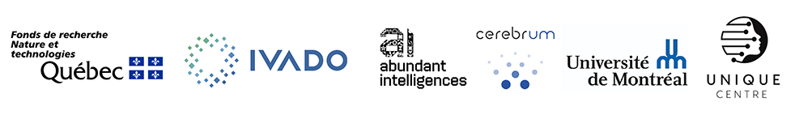

# Save the date

:::{important}
**MAIN educational 2026 will be held on October 26th-27th 2026, in Montréal.**

Registration and the detailed program will be announced on this website in the coming months.
:::

The educational workshop is organized by the [UNIQUE](https://www.unique.quebec/) NeuroAI center as part of the Montreal Artificial Intelligence and Neuroscience (MAIN) 2026 conference. This is an in person event.

Program coming soon.

