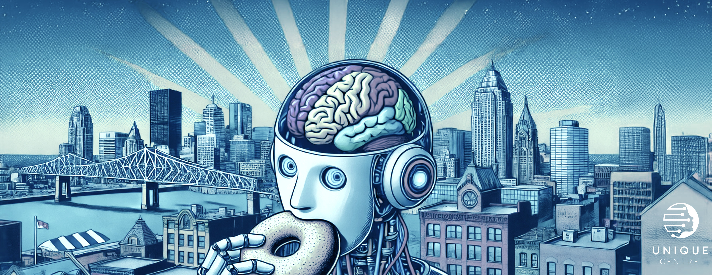

# Registration

:::{note}
**Registration for the event is now closed. We will update this website with the video recordings of each session in the near future.**
:::

The educational workshop is organized by the [UNIQUE](https://www.unique.quebec/) NeuroAI center as part of the Montreal Artificial Intelligence and Neuroscience (MAIN) 2025 [conference](https://www.main2025.org/). This is an in person event.

You will be required to bring a laptop and install software prior to the workshop and complete the [installation](installation) instructions. Coffee, snack and lunch will be offered onsite.

