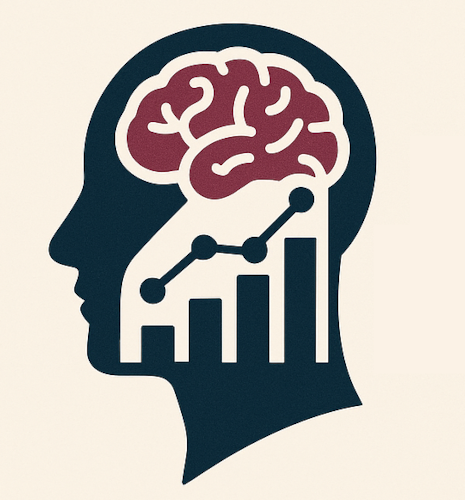
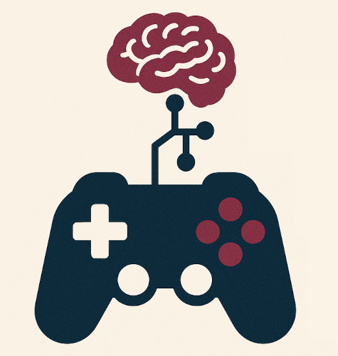
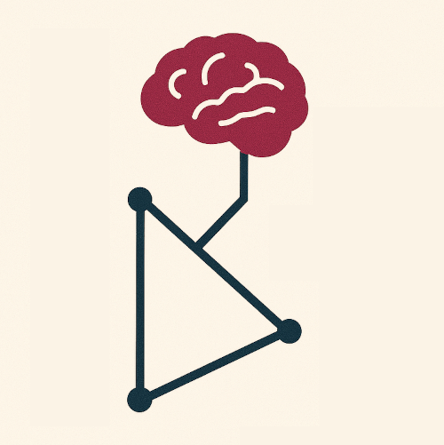

# Program

All educational sessions will run on a single track on December 11th 2025. Two different rooms will be used for the workshop: "Salle anciens membres du FPHEC" et "Salle Tkaronto".

 * 08:00-08:50 **Registration with coffee and snack** (room FPHEC)
 * 08:50-09:00 **Welcome** (room FPHEC)
 * 09:00-10:20 **Cognitive benchmarking in large models part I** (room FPHEC)
 * 10:20-10:40 **break with coffee and snack** (room FPHEC)
 * 10:40-12:00 **Cognitive benchmarking in large models part II** (room FPHEC)
 * 12:00-12:45 **Lunch provided** (room FPHEC)
 * 12:45-13:55 **Videogames and RL for neuroAI part I** (room FPHEC)
 * 14:10-15:15 **Videogames and RL for neuroAI part II** (room Tkaronto)
 * 15:15-15:35 **Break with coffee and snack** (room Tkaronto)
 * 15:35-17:30 **Computation in NeurAI: a dynamical systems persective** (room Tkaronto)

More details on each session can be found using the links below:

::::{grid}

```{card}
:header: 
:url: cognitive_benchmark_ai
Cognitive benchmarking in large models
```

```{card}
:header: 
:url: neuroai_videogames
Videogame and reinforcement learning for neuroAI
```

```{card}
:header: 
:url: neuroai_dynamical_systems
Computation in neuroscience & AI: a dynamical systems perspective
```
