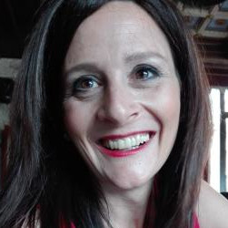
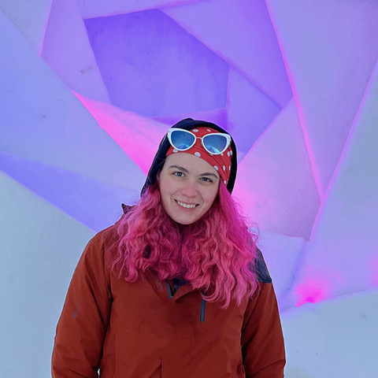

# Program

(scikitlearn)=
## Supervised learning using scikit-learn
This session introduces the fundamental principles of supervised machine learning using the scikit-learn library in Python.

### Instructor
::::{grid}
```{card}
:header: 
:url: https://www.mcgill.ca/ludmercentre/our-people/principal-investigators/jb-poline
Jean-Baptiste Poline
```
::::

**Jean-Baptiste (JB) Poline, PhD**, is a Professor in the Department of Neurology and Neurosurgery at McGill; the director of the [ORIGAMI](https://neurodatascience.github.io/) neuro-data-science laboratory, PI of the [Neurobagel](https://neurobagel.org) and [Nipoppy](https://nipoppy.readthedocs.io/en/latest/) projects, chair of the International Neuroinformatics Coordinating Facility (ex-officio), co-Chair of the NeuroHub and Chair of the Technical Steering Committee for the Canadian Open Neuroscience Platform (CONP) at the Neuro; and a Principal Investigator at the Ludmer Centre for Neuroinformatics & Mental Health. Among the early pioneers of functional magnetic resonance imaging (fMRI), today, Prof. Jean-Baptiste Poline is a leading researcher in the fields of neuroimaging, imaging genetics research, and neuroinformatics technologies.

### Objectives
  * Define machine-learning nomenclature
  * Describe basics of the “learning” process
  * Explain model design choices and performance trade-offs
  * Introduce model selection and validation frameworks
  * Explain model performance metrics

### Questions you will be able to answer after taking this module:
  * Model training - what is under/over-fitting?
  * Model selection - what is (nested) cross-validation?
  * Model evaluatation - what are type-1 and type-2 errors?

### Materials
::::{grid}
```{card}
:header: 
:url: https://github.com/neurodatascience/course-materials-2024/tree/ac3f7220a320fb234ced226ddf1c1acce25c2ee0/2024/08_machine_learning_1
`Github` repository
```
::::

## Model selection and validation using scikit-learn
This session introduces the fundamental principles of model selection using the scikit-learn library in Python.

### Instructor
::::{grid}
```{card}
:header: 
:url: https://github.com/nikhil153
Nikhil Bhagwat
```
::::

**Nikhil Bhagwat, PhD** is an Academic Associate in the [ORIGAMI lab](https://neurodatascience.github.io/) (PI: [Dr. JB Poline](https://www.mcgill.ca/neuro/jean-baptiste-poline-phd)) at McGill University. He completed his PhD thesis on prognostic applications for Alzheimer’s disease using MR imaging and machine-learning (ML) techniques in the [CoBrA Lab](https://www.cobralab.ca/) (PI: [Dr. Mallar Chakravarty](http://cobralab.ca/members/commander/)) at the University of Toronto. Subsequently, he worked as a researcher at the University of Massachusetts and the Allen Institute. His current research interests include disease staging, subtyping, and prognosis using ML models, along with development of neuroinformatics tools for improving [reproducibility](https://github.com/neurodatascience/mr_proc) and [sustainability](https://neuropipelines.github.io/10carbon) of computational pipelines.


### Objectives
 * Understand how to evaluate the performance of machine learning models.
 * Learn about hyperparameters and model selection.
 * Learn about pitfalls when validating machine learning models and how to easily avoid them using scikit-learn.

### Materials
::::{grid}
```{card}
:header: 
:url: https://github.com/neurodatascience/course-materials-2024/tree/ac3f7220a320fb234ced226ddf1c1acce25c2ee0/2024/09_machine_learning_2
`Github` repository
```
::::

## Machine learning in functional MRI using [Nilearn](https://nilearn.github.io)

### Instructors

::::{grid}
```{card}
:header: 
:url: https://scholar.google.com/citations?user=E3C4UtMAAAAJ&hl=en
Himanshu Aggarwal
```
```{card}
:header: 
:url: https://wanghaoting.com
Hao-Ting Wang
```
::::

**Himanshu Aggarwal** is a research engineer at the [MIND](https://team.inria.fr/mind/) team, INRIA Saclay, France, and is currently working as a core maintainer on [Nilearn](https://nilearn.github.io/). Previously, he was involved in the Individual Brain Charting (IBC) project with the same team, where he developed various cognitive experiments for task-based fMRI acquisitions, as well as documentation and preprocessing pipelines for the acquired data. His other recent projects involve subject fingerprinting and naturalistic task decoding with functional connectivity and improving task decoding accuracy in scarce data settings.

**Hao-Ting Wang, PhD** is a Canadian Neuroanalytic Scholar and postdoctoral fellow at CRIUGM. Her project focuses on discovery of transdiagnostic brain biomarkers amongst neurodegenerative conditions from multiple open access datasets. Her expertise lies in fMRI data processing, functional connectivity, and data workflow construction. She is also a core developer of Nilearn with a focus on fMRI data processing and feature extraction.

### Objectives
 * Understand the structure of functional magnetic resonance imaging data.
 * Generate correlation matrices using fMRI time series (aka "connectomes").
 * Visualize brain maps and connectomes.
 * Train machine learning models to classify subjects by age groups based on brain connectivity.

### Materials
::::{grid}
```{card}
:header: 
:url: https://github.com/main-educational/intro_nilearn
`Github` repository
```
```{card}
:header: 
:url: https://main-educational.github.io/intro_nilearn/intro.html
`Jupyter` book
```
::::

## Train machine learning models on MEG data using MNE-python and PyTorch


### Instructor
::::{grid}
```{card}
:header: 
:url: https://github.com/annapasca
Annalisa Pascarella
```
```{card}
:header: 
:url: https://scholar.google.com/citations?user=d9Dr5fkAAAAJ&hl=fr
Vanessa Hadid
```
::::

**Annalisa Pascarella**, PhD, is a senior researcher at Institute of Applied Mathematics M. Picone, National Council of Research in Rome (Italy). Her main research interests are centered on the formulation, implementation and validation of computational methods for the solution of the M/EEG inverse problems with a focus on Bayesian methods to track neural activity. In the last years she has been involved in the development of Neuropycon, an open-source brain data analysis kit which provides reproducible Python-based pipelines for advanced multi-thread processing of fMRI, M/EEG data. Some of her recent projects include the classification of mental states from M/EEG measurements during various meditation techniques by combining complexity measured and machine learning techniques.

**Vanessa Hadid**, PhD, is a postdoctoral researcher in the Faculty of Medicine at McGill University and the Department of Psychology at Université de Montréal, specializing in the neurophysiological analysis of sensory systems. She completed her Ph.D. in Experimental Medicine at Université de Montréal, where she used ML tools to decode unconscious processes in blindsight by exploring the structure and dynamics of EEG and MEG signals in cortical blindness. Currently, her postdoctoral research focuses on predicting cochlear implant outcomes using multimodal neuroimaging and ML approaches. Passionate about predicting cerebral plasticity, particularly under sensory deprivation, she aims to better understand the relationship between the brain and human behavior. She is also a lecturer, having taught several courses on cognitive and neurophysiological processes at both Université de Montréal and McGill University.

### Objectives
 * Understand the structure of electro- and magneto-encephalography signals
 * Preprocess and visualize MEG/EEG data
 * Learn about the ML techniques to decode evoked and induced MEG/EEG activity
 * Train machine learning models on MEG data using [MNE-python](https://mne.tools/stable/index.html) and PyTorch

### Materials
::::{grid}
```{card}
:header: 
:url: https://github.com/thecocolab/mne_meeg_ml_main
`Github` repository
```
::::

## Experimentation on in silico neural responses from encoding models
In this session you will use pre-trained encoding models from the [Neural Encoding Dataset](https://github.com/gifale95/NED) (NED) to generate in silico functional magnetic resonance imaging (fMRI) and electroencephalography (EEG) responses to images. You will then leverage the generated in silico neural responses for experimentation. Specifically, using relational neural control (RNC) you will explore in silico fMRI responses for tens of thousands of naturalistic images, to find controlling images that align or disentangle responses for different areas across visual cortex (e.g., V1, V4, FFA, PPA), thus isolating their shared and unique representational content.

### Instructor
::::{grid}
```{card}
:header: 
:url: https://github.com/gifale95
Alessandro (Ale) Gifford
```
::::

**Ale Gifford** is a PhD student doing research in cognitive computational neuroscience at the [Freie Universität Berlin](https://www.fu-berlin.de/en/index.html), Germany, as part of the [Neural Dynamics of Visual Cognition](https://www.ewi-psy.fu-berlin.de/en/psychologie/arbeitsbereiche/neural_dyn_of_vis_cog/index.html) Lab led by [Radoslaw Cichy](http://userpage.fu-berlin.de/rmcichy/). His work focuses on combining brain data with machine learning to gain novel insight and to develop new tools that advance the theoretical understanding of the algorithms underlying intelligent systems.

### Objectives
This session is divided into two halves, each combining theory and practice.

 * The first half will focus on in silico neural responses. Here you will:
   * Learn the advantages, limitations, and use cases of experimentation on in silico neural responses generated by encoding models;
   * Familiarize with the NED toolbox;
   * Use pre-trained encoding models from NED to generate in silico fMRI and EEG responses to images.

* The second half will focus on applying RNC on in silico fMRI responses to naturalistic images. Here you will:
   * Understand the concept of representational relationships;
   * Familiarize with the RNC paradigm and its use cases;
   * Learn how to use RNC to uncover shared and unique representational content across visual areas.

### Materials

::::{grid}
```{card}
:header: 
:url: https://github.com/gifale95/NED
NED `Github` repository
```
```{card}
:header: 
:url: https://drive.google.com/drive/folders/13aTI5eSK4yDosi63OfsyN20fLo6T5uNj?usp=drive_link
NED Colab tutorials
```
```{card}
:header: 
:url: https://github.com/gifale95/RNC
RNC `Github` repository
```
```{card}
:header: 
:url: https://drive.google.com/drive/folders/1ZTzbeZ1tNtBu2P6fgjbRY8-1KuY-0Kkr?usp=drive_link
RNC Colab tutorials
```
```{card}
:header: 
:url: https://docs.google.com/presentation/d/1RV6c8Xf3fwHTJF55TMwROoDzgoR5ujyXoSV3-i1eU08/edit?usp=sharing
Google slides
```
::::


## Understanding Representational Similarity Analysis

### Instructor
::::{grid}
```{card}
:header: 
:url: https://hamzaabdelhedi.com
Hamza Abdelhedi
```
::::

**Hamza Abdelhedi** is a PhD student at the faculty of medicine, Université de Montréal in Québec, Canada 🇨🇦, pursuing a degree in Biomedical Engineering. His passion lies in Artificial Intelligence 🤖, Neuroscience 🧠, Python programming 🐍, and open source projects. He thoroughly enjoys learning and contributing in various ways, particularly through coding projects that not only delve into the science but also aim to vulgarize and make it accessible to everyone. In addition to his current studies, he recently obtrained a M.Sc in Artificial Intelligence from Mila/UdeM. He also has a background in Telecommunication Engineering and Mathematics from my educational journey in Tunisia 🇹🇳.


### Objectives:
Representational Similarity Analysis (RSA) is a multivariate technique that links disparate types of data based on shared structures in their 	similarity (or distance) matrices. It is a powerful method for comparing and understanding neural representations across different conditions, 	modalities, or species. This tutorial aims to equip participants with the knowledge and skills needed to apply RSA in their own research.

#### Participants will:
 - **Understand the Concept of a Representational Dissimilarity Matrix (RDM)**: Learn what an RDM is and how it can be computed within the 	framework of RSA.
 - **Gain Hands-On Experience with RSA Techniques**: Work directly with datasets to perform RSA, including the computation and analysis of 	representational dissimilarity matrices (RDMs).
 - **Explore Applications Across Modalities**: Discuss how RSA can be applied to various data types, such as fMRI, M/EEG, behavioral data, 	and ANN activations, facilitating a multidisciplinary approach to understanding representation.
 - **Using Noise Ceilings and Random Models as Benchmark Tools**: Understand how these tools can provide critical benchmarks for 	interpreting RSA results.

### Materials
::::{grid}
```{card}
:header: 
:url: https://github.com/BabaSanfour/main-edu-courses-rsa
`Github` repository
```
::::


## Brain decoding

Within this session, we will go through the basics of running/applying `decoding models`
to `fMRI` data. More precisely, we will explore how we can utilize different `decoding models`
to `estimate`/`predict` what an agent is `perceiving` or `doing` based on `recordings` of `responses`/`activity`.
Given the time restrictions, we will focus on `biological agents`, ie `human participants`, and thus `brain` `responses` obtained from `fMRI`.

### Instructors
::::{grid}
```{card}
:header: 
:url: https://github.com/PeerHerholz
Peer Herholz
```
```{card}
:header: 
:url: https://github.com/pbarbarant
Pierre-Louis Barbarant
```
::::

**Peer Herholz** is a research affiliate at [The Neuro (Montreal Neurological Institute-Hospital)](https://www.mcgill.ca/neuro/)/[ORIGAMI lab](https://neurodatascience.github.io/) (PI: [Dr. JB Poline](https://www.mcgill.ca/neuro/jean-baptiste-poline-phd)) at [McGill University](https://www.mcgill.ca/) and the [McGovern Institute for Brain Research](https://mcgovern.mit.edu/)/[Senseable Intelligence Group](https://sensein.group/) (PI: [Satra Ghosh](https://satra.cogitatum.org/)). He obtained his PhD in cognitive & computational neuroscience, focusing on auditory processing in humans and machines. Afterwards, he conducted multiple postdocs further working at the intersection between neuroscience & artificial intelligence, as well as expanding the integration of open & reproducible scientific practices therein. Currently, he is working on research questions related to generalization in biological and artificial neural networks, comparing respective representations and their underlying computation.

**Pierre-Louis Barbarant** is a first-year PhD student with the [MIND](https://team.inria.fr/mind/) team at INRIA Saclay, France. His research focuses on enhancing fMRI hyperalignment techniques to improve brain decoding performance, leveraging machine learning models and optimal transport methods. He is a maintainer of the [FUGW](https://github.com/alexisthual/fugw) and [fmralign](https://github.com/Parietal-INRIA/fmralign) packages, which are used for inter-subject alignment in neuroimaging. Recently, he has also developed an interest in the neural representation of confidence and probabilistic reasoning in the human brain.

### Objectives 📍
 * Understand the core aspects & principles of `brain decoding`
   - including `dataset` requirements
 * Explore different `decoding models` that can be applied to `brain data`
   - `Support Vector Machines` (`SVM`s)
   - `Multilayer Perceptrons` (`MLP`s)
   - `Graph-Convolutional Neural Networks` (`GCN`s)
 * Get first hands-on experience using the respective `python` `libraries`

### Questions you will be able to answer after taking this module 🎯
  * What does `brain decoding` entail?
  * What kind of `data` and `information` is required for `brain decoding` analyses?
  * What are examples of suitable `decoding models` and what do they comprise?

### Materials

::::{grid}
```{card}
:header: 
:url: https://github.com/main-educational/brain_encoding_decoding
`Github` repository
```
```{card}
:header: 
:url: https://main-educational.github.io/brain_encoding_decoding
`Jupyter` book
```
::::

## Towards modelling high-level movement
::::{grid}
```{card}
:header: 
:url: https://scholar.google.com/citations?user=p8VD3GUAAAAJ&hl=en
Melanie Segado
```
::::

### Objectives
Quantifying movement and behaviour is essential across all of neuroscience, but traditional methods of collecting and analyzing movement data can be time-consuming, costly, and impractical in many real-world settings. This workshop introduces affordable, efficient strategies using video and pre-trained vision transformers as tools to gather contextually rich datasets, and movement foundation models as a way to combine them into joint insights. While the workshop will focus on human movement, the concepts will be broadly applicable across domains and species.

Participants will:
* gain hands-on experience with leading open-source tools,
* learn to extract detailed movement and contextual information from video using pre-trained models without the need for manual annotation,
* gain a deeper understanding of how to integrate this approach into broader research frameworks in neuroscience.

Specific concepts covered will include pre-trained vision transformers for movement analysis; movement tokenization; movement foundation models; foundation model fine-tuning.

::::{grid}
```{card}
:header: 
:url: https://github.com/quietscientist/Foundation_Models_Primer_MAIN2024EDU.git
`Github` repository
```
::::
