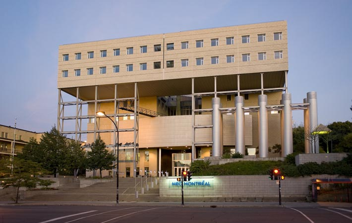

# Venue

The workshop will be located at [HEC Montréal’s Côté-Sainte-Catherine Building](https://www.hec.ca/en/campus/cote_sainte_catherine/) located at 3000 Chem. de la Côte-Sainte-Catherine, Montréal, QC H3T 2A7. The venue is accessible by Metro (Université de Montréal, blue line) or Bus (route 51).

<iframe src="https://www.google.com/maps/embed?pb=!1m14!1m8!1m3!1d5592.612923522394!2d-73.620559!3d45.5039091!3m2!1i1024!2i768!4f13.1!3m3!1m2!1s0x4cc919ed2e42c7f1%3A0x8eef83807a5ca907!2sC%C3%B4te-Sainte-Catherine%20Building!5e0!3m2!1sen!2sca!4v1763677202713!5m2!1sen!2sca" width="600" height="450" style="border:0;" allowfullscreen="" loading="lazy" referrerpolicy="no-referrer-when-downgrade"></iframe>
